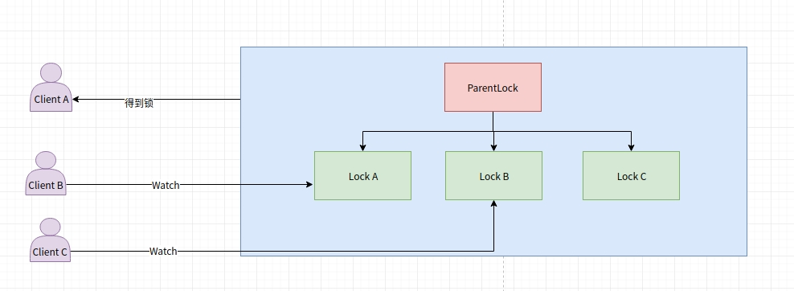

## 基于zookeeper的分布式锁    
基于zookeeper分布式锁运用了zookeeper临时顺序节点的特性来实现。  

本分布式锁使用了zookeeper工具Curator来实现，Curator能够更加方便快捷地构建zookeeper客户端连接，操作等
steak-zookeeper-lock使用springboot构建starter，能够快速的引入你的项目，只需简单的配置yml，在需要加锁的
方法上加上@ZookeeperLock便可  
#### Maven  
```
        <dependency>
            <groupId>com.steak.zklock</groupId>
            <artifactId>zookeeper-distribute-lock-starter</artifactId>
            <version>1.0.0</version>
        </dependency>
```  

#### @Zookeeper注解参数  

```
    /**
     * 锁名字(唯一)：可以自定义分布式锁名称，如果不指定，则指定为类路径
     */
    String lockName() default "";
    /**
     * 锁类型-默认为可重入排他锁
     */
    LockType lockType() default LockType.MUTEX_LOCK;
    /**
     * 过期时间
     */
    long requireTime() default 3;
```

#### springboot yml配置  

```
zk-lock:
  address: 127.0.0.1:2181
  connection-timeout: 1500000000
  session-timeout: 600000
  retry-policy: retry-forever #
  retry_forever:
    retry-interval-ms: 3000
```


### 原理  
#### 获取锁：

1.在 Zookeeper 当中创建一个持久节点 ParentLock。当第一个客户端想要获得锁时，需要在 ParentLock 这个节点下面创建一个临时顺序节点 LockA。

2.ClientA 查找 ParentLock 下面所有的临时顺序节点并排序，判断自己所创建的节点 LockA 是不是顺序最靠前的一个。如果是第一个节点，则成功获得锁。

3.这时候，如果再有一个客户端 ClientB 前来获取锁，则在 ParentLock 下载再创建一个临时顺序节点 LockB。

4.ClientB 查找 ParentLock 下面所有的临时顺序节点并排序，判断自己所创建的节点 LockB 是不是顺序最靠前的一个，结果不是，ClientB 向排序仅比它靠前的节点 LockA 注册 Watcher，用于监听 Lock1A节点是否存在。这意味着 Client2B抢锁失败，进入了等待状态。

5.这时候，如果又有一个客户端 ClientC前来获取锁，则在 ParentLock 下载再创建一个临时顺序节点 LockC。

6.ClientC 查找 ParentLock 下面所有的临时顺序节点并排序，判断自己所创建的节点 LockC 是不是顺序最靠前的一个，结果同样发现节点 LockC并不是最小的。
于是，ClientC向排序仅比它靠前的节点 LockB注册 Watcher，用于监听 LockB节点是否存在。这意味着 ClientC同样抢锁失败，进入了等待状态。
****
这样一来，ClientA 得到了锁，ClientB监听了 LockA，ClientC监听了 LockB,形成了一个等待队列，

#### 释放锁：

任务完成，客户端显示释放

当任务完成时，ClientA 会显示调用删除节点 LockA 的指令。

任务执行过程中，客户端崩溃

获得锁的 ClientA 在任务执行过程中，如果崩溃，则会断开与 Zookeeper 服务端的链接。根据临时节点的特性，相关联的节点 LockA 会随之自动删除。

由于 ClientB 一直监听着 LockA的存在状态，当 LockA节点被删除，ClientB会立刻收到通知。这时候 ClientB 会再次查询 ParentLock 下面的所有节点，确认自己创建的节点 LockB 是不是目前最小的节点。如果是最小，则 ClientB 顺理成章获得了锁。

ClientC也是同理 


